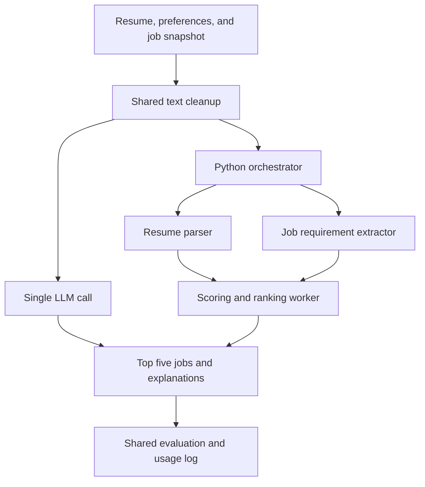

# One Agent or Many?

**Orchestrated vs. Single-Agent Resume-to-Job Matching**  
CSCE 585: Machine Learning Systems | Fall 2026

This project compares two ways to match a resume with job postings: a single LLM call and a workflow with specialized workers. We will measure whether splitting up the work improves recommendations enough to justify the additional latency and token cost.

**Status:** Project proposal. The implementation and experiments described below are planned work.

## Team and Responsibilities

| Member | Main responsibility |
|---|---|
| Aidan | Build the single-agent baseline and shared input/output format. |
| Kevin Do | Build the orchestration workflow and worker prompts. |
| Ritvik | Prepare job data, coordinate labeling, and build the evaluation script. |

We have firsthand experience with the new-grad job search and our own resumes for initial testing. Everyone will review matches and results. We plan to meet weekly and track work through GitHub issues, commits, and short milestone notes.

## Feedback Received and Responses

The following feedback came from the project presentation. The exact discussion date was not recorded in these notes.

| Feedback received | Source/date | Team response | Change to the proposal |
|---|---|---|---|
| Add additional job datasets. | Presentation discussion; date not recorded | Accepted | Build a small, fixed collection from Greenhouse and Lever postings, using SimplifyJobs to help identify relevant employers and roles. |
| Look into how Simplify matches candidates to jobs. | Presentation discussion; date not recorded | Accepted | Added a related-work comparison covering its documented matching inputs and the limits of what its public description reveals. |
| Explain how token costs will be calculated. | Presentation discussion; date not recorded | Accepted | Added per-call accounting, a worked example, and a distinction between initial processing and reused job requirements. |

## Problem and Motivation

In our own new-grad job searches, we repeatedly compare our experience with job requirements. A useful matcher should recommend relevant opportunities and explain the fit without overlooking requirements or inventing qualifications.

The **ML component** is LLM-based extraction and ranking. The **systems component** is measuring whether orchestration improves results enough to offset extra requests, latency, and inference cost. The project explores this systems question through a small prototype.

We will use resumes with permission and remove identifying details before API use. Recommendations will depend on documented qualifications and stated preferences. The small sample will not support claims about hiring outcomes or fairness across demographic groups.

## Research Questions and Hypotheses

| Question | Hypothesis |
|---|---|
| **RQ1:** Does orchestration improve the relevance of the top five recommendations? | Separating extraction from ranking will improve Precision@5, especially when a resume covers several kinds of experience. |
| **RQ2:** What additional latency and token cost does orchestration introduce? | The orchestrated workflow will usually cost more and take longer because it makes additional LLM calls. |
| **RQ3:** Does the trade-off change with more job postings? | Increasing the candidate set from 20 to 50 postings will increase processing cost and may make specialized extraction more useful. |

These are hypotheses to test. A result favoring the single-agent approach is still a useful project outcome.

## Related Work

- **Simplify:** Its public description says matching considers profiles, skills, experience, preferences, and interview responses, and learns from user interactions. This motivates checking both qualifications and preferences in our matcher. The page does not specify its ranking formula, model, or agent architecture. We will use Simplify as a product reference, while benchmarking our own implementations with identical data. [Simplify AI Job Search](https://simplify.jobs/ai-job-search)
- **AutoGen:** Wu et al. describe interacting, customizable agents. We draw on the idea of separate worker roles, but study a fixed matching workflow and its overhead. Using the AutoGen framework is not required. [AutoGen paper, version 2](https://arxiv.org/abs/2308.08155v2)
- **Building effective agents:** Anthropic distinguishes predefined workflows from LLM-directed agents and discusses quality, cost, and latency trade-offs. This informs our choice of a fixed workflow. Our contribution is testing the trade-off on resume matching. [Anthropic engineering article](https://www.anthropic.com/engineering/building-effective-agents)

## Proposed System or Approach

Both methods will receive the same cleaned resume text, explicit job preferences, and job descriptions. Both will return JSON containing five ranked job IDs and short explanations grounded in the supplied text.



**Single-agent baseline:** One prompt asks the model to read the resume and all candidate postings, assess fit, and return the ranking.

**Orchestrated workflow:** A Python controller makes three sequential calls: parse the resume, extract requirements from the candidate postings in one batch, and rank jobs using those structured outputs. The controller needs no additional LLM call. Here, “multi-agent” means role-specific LLM workers in a fixed workflow.

**Reused components:** One hosted LLM and its Python SDK, job-data endpoints, and standard Python analysis libraries. We will select an affordable model during the pilot and fix its version across both methods. A laptop and API access should suffice; no model training or dedicated GPU is planned.

**Team contribution:** The matchers, prompts, output validation, labeled workload, and experiment script. We will use Python scripts and JSON/CSV files. Resume rewriting, automatic applications, a production website, and large-scale scraping are outside scope.

## Evaluation Plan

### Data and workload

| Source | Planned use |
|---|---|
| [SimplifyJobs New-Grad Positions](https://github.com/SimplifyJobs/New-Grad-Positions) | Identify new-grad roles and employers. Treat the repository as a listings index; obtain complete descriptions from the linked employer sources. |
| [Greenhouse Job Board API](https://docs.greenhouse.io/job-board.html) | Create one snapshot of roughly 25 relevant postings across several employers. Public GET endpoints provide postings, with full descriptions available through `content=true`. |
| [Lever Postings API](https://github.com/lever/postings-api) | Create a second snapshot of roughly 25 postings from other employers. Preserve descriptions and requirement lists when converting records to plain text. |

We will select a short list of employers using Greenhouse and Lever and focus on early-career software/data roles. After deduplication, the snapshots will form one approximately 50-job collection, retaining source URLs, IDs, dates, and full text. Both workload sizes will include jobs from both sources.

We will target **10 resumes: two for development and eight held out for evaluation**, from team members and consenting volunteers. We will freeze prompts after development and identify any supplemental synthetic resumes separately.

The small workload will use 20 postings from the fixed collection; the larger workload will use all 50. Both methods receive the complete set, without retrieval. We will check context/output limits during the pilot and reduce the workload equally for both methods if needed.

### Human labels

Before examining predictions, we will label each evaluation resume against all 50 jobs: **400 resume-job judgments**. Relevance requires fit with demonstrated core qualifications and stated constraints, such as role level and location. Missing a preferred skill alone will not make a job irrelevant.

A second team member will independently review at least 20% of pairs. We will record agreement and resolve unclear cases using a shared rubric. Human judgments will provide the reference labels.

### Experiments and controls

| Experiment | Research question | Comparison |
|---|---|---|
| Main quality comparison | RQ1 | Precision@5 for both architectures on identical resume-job inputs. |
| Systems comparison | RQ2 | Per-resume latency, token usage, estimated API cost, throughput, and failures. |
| Workload-size comparison | RQ3 | Repeat the same comparison with 20 and 50 postings. |

The main experiment requires **8 resumes × 2 architectures × 2 sizes × 3 repetitions = 96 matching runs**. Repetitions measure variation, not additional independent resumes. We will fix the model, temperature, final-output limit, preferences, and hardware. Intermediate extraction limits will be documented. Job-order seeds will be paired across architectures, and execution order alternated to reduce timing bias.

One small ablation will reuse saved job requirements for two evaluation resumes at the larger size, with three repetitions each. These six runs isolate repeated extraction overhead. The main experiment will recompute intermediate outputs every time.

### Metrics and interpretation

| Metric | Definition |
|---|---|
| Precision@5 | Number of human-labeled relevant jobs among the five recommendations, divided by five. Missing, duplicate, or invalid job IDs receive no credit. |
| Latency | Wall-clock seconds from matcher input to validated output, including retries. Report median and range. |
| Token usage and cost | Total billed tokens and estimated USD across every call used for a resume. |
| Throughput | Successfully completed resumes divided by total batch execution time in minutes, at one resume at a time. |
| Failure rate | Percentage of attempted runs that still fail after one allowed retry. Keep their time and cost in the results. |

We will report mean Precision@5, variation across repetitions, and paired differences by resume. Failed runs score zero. We will inspect sample explanations for unsupported claims and discuss resume length and breadth of experience as an exploratory breakdown.

Our provisional criterion is **at least five percentage points higher mean Precision@5 on the larger workload, with cost and latency each no more than twice the baseline**. This project-specific rule uses mean cost and median latency. Mixed or negative results remain useful, with conclusions limited to this workload.

### How token costs will be calculated

Each request log will contain the model, worker, input/output tokens, time, retry number, and prices. Counts will come from API usage metadata. Prompts and intermediate results count again whenever another call receives them.

With ordinary input/output billing and prices in USD per million tokens:

```text
call_cost = (input_tokens × input_price + output_tokens × output_price) / 1,000,000
resume_cost = sum(call_cost for every call and retry used for that resume)
```

**Illustrative example:** Assume input costs **$0.50 per million tokens** and output costs **$2.00 per million tokens**. These are example prices, not a quote for the model we will select.

| Method | Total input tokens | Total output tokens | Calculation | Cost per resume |
|---|---:|---:|---|---:|
| Single agent | 8,000 | 1,000 | `(8,000 × 0.50 + 1,000 × 2.00) / 1,000,000` | $0.006 |
| Orchestrated, all calls combined | 16,000 | 2,500 | `(16,000 × 0.50 + 2,500 × 2.00) / 1,000,000` | $0.013 |

Here, orchestration adds **$0.007 per resume** and costs about **2.17 times** as much. Experiments will use dated, published provider prices. Cache reads/writes can have separate rates, as shown in [Anthropic's pricing documentation](https://platform.claude.com/docs/en/about-claude/pricing). We will count each billed category once, including any billed reasoning tokens, and use matching provider-cache settings. Missing usage from failed requests will be marked unknown.

For the reuse ablation, we will report initial extraction cost separately and calculate `amortized cost = preparation cost / requests reusing it + mean per-request cost`. A small pilot will estimate the full run against a proposed **$20 budget**. We will reduce scope if needed.

## Expected Deliverables

- Source code for both matchers and a shared experiment runner.
- Versioned prompts, configuration, a labeling rubric, and permitted sample data with source records.
- Raw run logs and a comparison table covering quality, latency, token cost, and failures.
- A quality-versus-cost plot, a latency comparison, and a few examples showing where either method succeeds or fails.
- Setup/reproduction instructions, a short demo, and the final report and presentation.

## Timeline and Milestones

These are planning windows relative to implementation start. The final presentation will follow the course's announced date.

| Period | Milestone and evidence of completion | Owner(s) |
|---|---|---|
| Weeks 1–2 | Collect both job snapshots, agree on labels, and run one baseline example with a cost log. | Ritvik, Aidan; Kevin reviews interfaces |
| Weeks 3–4 | Complete the orchestrated workflow and run both methods on development resumes. Freeze the model, prompts, and workload after the pilot. | Kevin, Aidan; Ritvik checks logs |
| Weeks 5–6 | Finish evaluation labels and run the main experiment and small reuse ablation. Produce the first comparison table. | Ritvik leads; all label and review |
| Weeks 7–8 | Analyze results, write limitations, and prepare the demo, report, and presentation. | All |
| Remaining time before the final presentation | Resolve necessary fixes and rehearse, with a recorded demo as backup. | All |

## Risks and Mitigations

| Risk | Early warning | Mitigation and fallback |
|---|---|---|
| Too few usable job descriptions | Missing or duplicate descriptions during collection | Check both sources early and save snapshots. If needed, use fewer employers/postings and document the resulting coverage. |
| API cost or context limits | Pilot exceeds the budget estimate or truncates inputs/outputs | Reduce the larger candidate set equally for both methods and keep the paired comparison. |
| Inconsistent human labels | Reviewers disagree on core requirements | Clarify the rubric on development examples, resolve uncertain labels, and narrow claims if ambiguity remains. |
| Too few volunteer resumes | Fewer than eight evaluation resumes available by the pilot | Seek permission early; use clearly identified synthetic examples as a separate supplemental workload if needed. |
| API errors or unfinished features | Repeated failures in the pilot | Allow one logged retry and prioritize the two scripts and results table. Use saved outputs for the final demo if necessary. |

## Reproducibility Plan

We will record dependencies, model/version, prompts, settings, seeds, hardware/OS, data snapshots, source dates, and prices. Scripts will reproduce a matching comparison and regenerate figures from saved logs. Setup and run commands will be added with the implementation.

We will record external repository commits used for data or code. Shared data will follow source reuse terms and resume-owner consent. Where redistribution is restricted, we will provide source records and preparation instructions. API keys and identifiable resumes will remain outside GitHub.

Raw outputs and usage logs will accompany results. AI assistance helped draft this proposal and locate references. Later assistance that materially shapes code or analysis will also be documented.

## References

1. [Simplify: AI Job Search](https://simplify.jobs/ai-job-search) — public description of matching inputs and product behavior.
2. [Wu et al.: AutoGen: Enabling Next-Gen LLM Applications via Multi-Agent Conversation, v2](https://arxiv.org/abs/2308.08155v2) — background on agent roles and interaction patterns.
3. [Anthropic: Building effective agents](https://www.anthropic.com/engineering/building-effective-agents) — workflow design and complexity trade-offs.
4. [SimplifyJobs: New-Grad Positions](https://github.com/SimplifyJobs/New-Grad-Positions) — index of new-grad opportunities.
5. [Greenhouse: Job Board API](https://docs.greenhouse.io/job-board.html) — published job data and descriptions.
6. [Lever: Postings API](https://github.com/lever/postings-api) — company job postings and structured fields.
7. [Anthropic: API pricing](https://platform.claude.com/docs/en/about-claude/pricing) — example of input, output, and cache billing categories.

Public references reviewed September 10, 2026. Actual experiment prices and data versions will be recorded when the experiments run.
