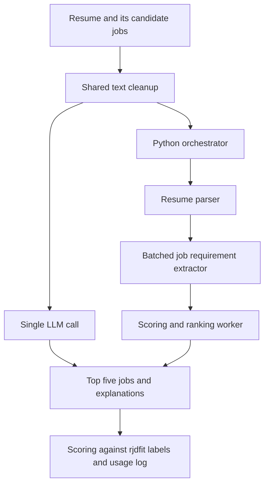

# One Agent or Many?

**Orchestrated vs. Single-Agent Resume-to-Job Matching**  
CSCE 585: Machine Learning Systems | Fall 2026

This project compares two ways to match a resume with job postings: a single LLM call and a workflow of specialized LLM workers. We measure whether splitting up the work improves recommendations enough to justify the extra latency and token cost. Neither approach is trained or fine-tuned. Both prompt the same frozen model.

**Status:** Both matchers are implemented, tested offline and evaluated on the public [rjdfit dataset](#deviation-from-the-original-proposal) (28 held-out resumes, Qwen3 4B and Qwen3 14B on a Colab A100). Single-agent scored higher on nDCG@5 at both model sizes, but the gap is within noise, and multi-agent costs about 4x the time and 3x the tokens. See [Results on rjdfit](#results-on-rjdfit). The latest progress slides are in `progress_update_2026-10.pptx`.

## Deviation from the original proposal

The original plan used 50 job postings (Greenhouse and Lever) and 10 student resumes, with 400 resume-job pairs labeled by the three of us. We replaced that workload with the public [`cnamuangtoun/resume-job-description-fit`](https://huggingface.co/datasets/cnamuangtoun/resume-job-description-fit) dataset ("rjdfit") because it already has labels, which removes the biggest threat to the evaluation (our own judgments) and gives us far more resumes.

What changed:

| | Original proposal | Now |
|---|---|---|
| Resumes | 10 anonymized student resumes (8 evaluated) | 30 real-world resumes sampled from rjdfit (2 dev, 28 eval) |
| Jobs | 50 postings we collected, 20 or 50 per run | Each resume's own labeled jobs from rjdfit, 8 to 20 per resume |
| Labels | 400 pairs labeled by the team | rjdfit's labels: No Fit, Potential Fit, Good Fit |
| Main metric | Precision@5 | nDCG@5 (also precision@5, top-1 hit rate, and a random baseline) |
| Workload size (RQ3) | 20 vs 50 jobs | Small, medium and large pools (<=12, 13-16, >16 jobs) |
| Reuse ablation | 6 runs reusing extracted job requirements | Not part of the new evaluation |

What did not change: the single-agent and orchestrated matchers, their prompts, the model, the output contract and the cost accounting.

Things to keep in mind when reading rjdfit results:
- The dataset page has no card, so we cannot tell how the labels were produced (people, rules or an LLM). We should not call them "human labels" in the report unless we confirm that.
- The text is messy PDF-style text. The resumes cover many fields (IT, data, sales and more), and many postings are recruiter emails, not clean job ads. `shared/rjdfit_eval.py` splits the text into short lines so the orchestrator's evidence selection works.
- About 58% of the jobs in our pools are Potential or Good Fit, so choosing five jobs at random already gets precision@5 near 0.6. nDCG@5 (which also rewards ranking Good above Potential) is the main number, and the summary prints the random baseline next to precision.

## Results on rjdfit

28 held-out resumes (pools of 8 to 20 jobs), one run per resume per architecture, temperature 0, Colab A100. Failed runs would score 0. nDCG@5 is the main metric; random Precision@5 is 0.583. Summary files are in [`results_summary/`](results_summary/) (raw model responses stay on Drive because they contain dataset text).

| Model | Architecture | nDCG@5 | Precision@5 | Top-1 hit | Failed runs | Median time | Median tokens |
|---|---|---:|---:|---:|---:|---:|---:|
| Qwen3 4B | Single | 0.568 | 0.679 | 0.643 | 0 of 28 | 5.5s | 9.9k |
| Qwen3 4B | Orchestrated | 0.512 | 0.629 | 0.607 | 2 of 28 | 20.9s | 32.2k |
| Qwen3 14B (q4_K_M) | Single | 0.533 | 0.700 | 0.714 | 0 of 28 | 10.6s | 9.9k |
| Qwen3 14B (q4_K_M) | Orchestrated | 0.486 | 0.664 | 0.429 | 0 of 28 | 40.8s | 32.0k |

What the numbers say:
- **No evidence that splitting the work helps.** On the 14B run, single was better on 15 resumes, orchestrated on 12 and 1 tied. The mean nDCG@5 gap is -0.047 (bootstrap 95% interval about -0.14 to +0.02). On the 4B run it was -0.056, and the two failed runs (below) were the whole gap.
- **A bigger model did not raise nDCG@5.** Both architectures dropped about 0.03 from 4B to 14B; Precision@5 rose slightly. Both are only modestly above the 0.58 random baseline.
- **Cost.** Orchestrated used about 3.9x the time and 3.2x the tokens at both sizes. The 14B eval took about 24 minutes of model time (4.7 single, 19.1 orchestrated) versus about 14 for 4B.
- **One resume drives much of the 14B gap.** On P06 (a software-engineering resume) the orchestrated ranker said the resume "highlights skills in accounting" and picked five accounting jobs (nDCG@5 0.00; single got 0.97). Its resume parser had correctly listed C#, ASP.NET and SQL, so the error is in the ranking step. Without P06 the mean gap is about -0.01.
- **Pool size (14B, hints only, 9 / 7 / 12 resumes):** orchestrated is behind on pools of 12 or fewer jobs (0.41 vs 0.56) and level on larger pools (13-16: 0.54 vs 0.52; over 16: 0.51 vs 0.52). See `results_summary/rjdfit_14b/by_pool_size.csv`.

Why the 4B orchestrated runs failed: on P03 and P17 the resume parser listed about 60 skills and hit its 2,000-token output cap, twice. The fix (in `shared/local_14b_experiment.json` and `orchestrator/prompts/resume.txt`) raises the cap to 4,000 tokens and asks for at most 15 skills. The 4B numbers above were produced before that fix; the 14B run used it and had no failures. Because the parser limits and the model both changed between the two runs, 4B versus 14B is not a clean model-size comparison.

Caveats: one run per resume (no run-to-run variance), the dataset's labels are of unknown origin, and the ranker in the orchestrated pipeline sees the parsed resume facts, not the full resume (an untested idea is to give it the full resume).

### Results from the original workload (superseded)

Before the switch we ran the full 96-run comparison on our own 400 labels (Qwen3 4B through Ollama on a Colab A100). The raw files were removed from the repo and remain in git history. Summary:

| Jobs | Single P@5 | Multi P@5 | Single median time | Multi median time | Single tokens/run | Multi tokens/run |
|---|---:|---:|---:|---:|---:|---:|
| 20 | 0.433 | 0.383 | 13.4s | 51.9s | 32,676 | 90,944 |
| 50 | 0.317 | 0.317 | 33.4s | 197.6s | 76,572 | 214,775 |

Multi-agent was no more accurate at either size, was 4 to 6 times slower and used about 2.8 times the tokens, so the decision rule below was not met on that workload. These labels were made by Kevin, Ritvik and Aidan with the rubric, and the planned independent second review was never done.

## Repository layout

| Location | Purpose |
|---|---|
| [`orchestrator/`](orchestrator/) | Kevin's three-worker workflow, extraction validation and worker prompts. |
| [`single_agent/`](single_agent/) | The one-call baseline. |
| [`shared/`](shared/) | Model client and cost logging, the shared ranking prompt, model configs, the rjdfit evaluation (`rjdfit_eval.py`) and tests. |
| [`colab/rjdfit_eval.ipynb`](colab/rjdfit_eval.ipynb) | Runs the whole rjdfit evaluation on a Colab GPU. |
| [`results_summary/`](results_summary/) | Summary tables (comparison, per-resume, pool size, manifest) for the 4B and 14B runs. |
| [`data/`](data/) | Where the downloaded dataset and built pools go (git-ignored). See [`data/README.md`](data/README.md). |
| [`progress_update_2026-10.pptx`](progress_update_2026-10.pptx), [`585 Presentation.pptx`](585%20Presentation.pptx) | Progress update and original proposal slides. |

## Quick start

Run these from the repository root (Python 3.9 or newer).

```sh
python3 -m unittest shared.test_workflow shared.test_rjdfit        # offline tests, no model needed
pip install datasets
python3 -m shared.rjdfit_eval download                              # saves data/rjdfit/*.csv
python3 -m shared.rjdfit_eval build                                 # makes the 30 resume pools
python3 -m shared.rjdfit_eval run --config shared/local_experiment.json --split dev --output results/dev --execute
python3 -m shared.rjdfit_eval run --config shared/local_experiment.json --split eval --output results/eval --execute
python3 -m shared.rjdfit_eval summarize results/eval
```

Leave out `--execute` to print the plan without calling a model. `--resume` continues an interrupted run. Output folders are never overwritten.

For a GPU, open [`colab/rjdfit_eval.ipynb`](colab/rjdfit_eval.ipynb) in Colab, push your latest code first (it clones `origin/main`), pick a GPU runtime and choose **Run all**. It does the download, build, dev check, eval and summary, and saves runs to Google Drive.

Pick the model with `--config`:
- `shared/local_experiment.json`: `qwen3:4b-instruct-2507-q4_K_M` through Ollama at `http://127.0.0.1:11434`. No API key. API charges are $0. Hardware and electricity are not measured.
- `shared/local_14b_experiment.json`: `qwen3:14b-q4_K_M` (4-bit, thinking off, 40,960-token context) through Ollama, with the resume parser output cap raised to 4,000 tokens. Used for the 14B rerun; results go to a separate Drive folder.
- `shared/experiment.json`: OpenAI `gpt-4.1-mini-2025-04-14`. Needs `OPENAI_API_KEY` in your shell or a git-ignored `.env`. Prices are dated October 6, 2026: $0.40 input, $0.10 cached input and $1.60 output per million tokens ([source](https://developers.openai.com/api/docs/models/gpt-4.1-mini)). The budget guard is $20 per invocation.

## Team and responsibilities

| Member | Main responsibility |
|---|---|
| Aidan | Single-agent baseline and shared input/output format. |
| Kevin Do | Orchestration workflow and worker prompts. |
| Ritvik | Data, evaluation script and results. |

## Feedback received and responses

| Feedback received | Team response | Change |
|---|---|---|
| Add additional job datasets. | Accepted | First built a Greenhouse and Lever collection. Now evaluating on the public rjdfit dataset instead (see above). |
| Look into how Simplify matches candidates to jobs. | Accepted | Added a related-work note on its documented inputs. |
| Explain how token costs will be calculated. | Accepted | Per-call accounting, described below. |
| Find a labeled dataset and deviate from the proposal if needed. | Accepted | Switched to rjdfit. |

## Problem and motivation

A useful matcher should recommend relevant jobs and explain the fit without overlooking requirements or inventing qualifications. The **ML component** is LLM-based extraction and ranking. The **systems component** is measuring whether orchestration improves results enough to offset extra requests, latency and inference cost.

The data has no demographic labels, and the small sample will not support claims about hiring outcomes or fairness.

## Research questions and hypotheses

| Question | Hypothesis |
|---|---|
| **RQ1:** Does orchestration improve the relevance of the top five recommendations? | Separating extraction from ranking will improve ranking quality, especially for resumes that cover several kinds of experience. |
| **RQ2:** What extra latency and token cost does orchestration add? | It will usually cost more and take longer because it makes more LLM calls. |
| **RQ3:** Does the trade-off change with more jobs to choose from? | Larger pools will raise cost and may make specialized extraction more useful. |

A result favoring the single-agent approach is still a useful outcome.

## Related work

- **Simplify:** Its public description says matching considers profiles, skills, experience, preferences and interview responses. It does not describe its model or architecture, so we use it only as a product reference. [Simplify AI Job Search](https://simplify.jobs/ai-job-search)
- **AutoGen:** Wu et al. describe interacting, customizable agents. We use the idea of separate worker roles but study a fixed workflow and its overhead. [AutoGen paper, version 2](https://arxiv.org/abs/2308.08155v2)
- **Building effective agents:** Anthropic separates predefined workflows from LLM-directed agents and discusses quality, cost and latency trade-offs. [Anthropic engineering article](https://www.anthropic.com/engineering/building-effective-agents)

## Approach

Both methods get the same cleaned resume text, the same jobs and the same ranking prompt, and both return JSON with five ranked job IDs and short explanations grounded in the supplied text.


```mermaid
flowchart TD
    A["Resume and its candidate jobs"] --> B["Shared text cleanup"]
    B --> C["Single LLM call"]
    B --> D["Python orchestrator"]
    D --> E["Resume parser"]
    E --> F["Batched job requirement extractor"]
    F --> G["Scoring and ranking worker"]
    C --> H["Top five jobs and explanations"]
    G --> H
    H --> I["Scoring against rjdfit labels and usage log"]
```

**Single agent:** one prompt reads the resume and all candidate jobs and returns the ranking (`single_agent/`).

**Orchestrated:** a Python controller makes three sequential calls: parse the resume, extract requirements from all jobs in one batch, then rank using those outputs (`orchestrator/`). "Multi-agent" here means role-specific LLM workers in a fixed workflow.

**Reused components:** a fixed LLM, the standard-library HTTP client in `shared/common.py` and the public rjdfit dataset. No model training is planned. Resume rewriting, automatic applications and a production site are out of scope.

## Evaluation plan

### Data and workload

`python3 -m shared.rjdfit_eval build` groups the dataset by resume. It keeps resumes that have at least 8 labeled jobs, at least 2 of them Potential or Good Fit, drops pairs whose duplicate rows disagree on the label, and samples up to 20 jobs per resume. It then picks 30 resumes (seed 585): the first 2 are dev and the other 28 are eval. Everything is deterministic, so the same inputs always give the same pools. The built pools are in `data/rjdfit_workload/pools.jsonl` (git-ignored, regenerate with the two commands above).

Each run gives one matcher one resume plus that resume's pool, in a shuffled order that is paired across the two architectures. Both matchers see the full pool, with no retrieval. Failed or invalid runs score zero.

### Metrics

| Metric | Definition |
|---|---|
| nDCG@5 (main) | Graded ranking quality of the top five: Good Fit counts 3, Potential Fit counts 1, No Fit counts 0, divided by the best possible ordering of that pool. Invalid or duplicate job IDs get no credit. |
| Precision@5 | Share of the five picks labeled Potential or Good Fit. Shown next to a random-pick baseline (the pool's relevant share). |
| Top-1 hit rate | Whether the first pick is Potential or Good Fit. |
| Latency | Wall-clock seconds per resume, including retries. Median is reported. |
| Tokens and cost | Total tokens and estimated USD across every call and retry. |
| Failure rate | Share of runs that still fail after one allowed retry. |

We report per-architecture means, paired differences by resume (how many resumes the orchestrated version wins, loses and ties), and a breakdown by pool size (`by_pool_size.csv`).

Provisional decision rule (unchanged): the orchestrated approach is worth it only if it gains at least 5 points on the main quality metric with mean cost and median latency each at most twice the baseline. Mixed or negative results are still results, and conclusions are limited to this dataset.

### How token costs are calculated

Each request log records the model, worker, input and output tokens, time, retry number and prices. Counts come from usage metadata, and prompts and intermediate results count again whenever another call receives them.

```text
call_cost = ((input_tokens - cached_tokens) × input_price
             + cached_tokens × cached_input_price
             + output_tokens × output_price) / 1,000,000
resume_cost = sum(call_cost for every call and retry used for that resume)
```

Local Ollama runs have $0 API charges. Hardware and electricity are not measured. Missing usage stays unknown, never free.

## Expected deliverables

- Source code for both matchers and the rjdfit evaluation, with offline tests.
- Versioned prompts and configs, and the Colab notebook that reproduces the run.
- Comparison tables (quality, latency, tokens, failures) and a few example resumes where one approach wins or fails.
- Final report and presentation.

## Risks and mitigations

| Risk | Mitigation |
|---|---|
| rjdfit labels may be noisy or machine-made, so scores measure agreement with those labels, not true fit | Say so in the report. Spot-check a sample of pairs by hand before drawing conclusions. |
| Messy resume and job text may break the orchestrator's line-ID evidence step | `shared/rjdfit_eval.py` splits text into short lines. Run the dev check first and read the failures. |
| High random baseline (about 0.6 precision@5) makes precision hard to read | Use nDCG@5 as the main metric and always show the random baseline. |
| Small model or long inputs cause failures or truncation | Dev check before the eval, one logged retry, and failures scored zero but kept in time and cost totals. |
| API cost | Local model by default. The cloud config has a $20 per-invocation guard. |

## Reproducibility

Each run's `manifest.json` records the config and prices, hashes of the workload and code, every prompt, and the start time. Raw model responses are saved under git-ignored `results/`, because they contain dataset text. Dependencies are the Python standard library for the matchers, plus `datasets` for the download and Ollama for local inference.

AI assistance materially contributed to the implementation, prompts, tests and these instructions.

## References

1. [Simplify: AI Job Search](https://simplify.jobs/ai-job-search) for a public description of matching inputs.
2. [Wu et al.: AutoGen, v2](https://arxiv.org/abs/2308.08155v2) for background on agent roles.
3. [Anthropic: Building effective agents](https://www.anthropic.com/engineering/building-effective-agents) for workflow design trade-offs.
4. [cnamuangtoun/resume-job-description-fit](https://huggingface.co/datasets/cnamuangtoun/resume-job-description-fit) is the labeled dataset we evaluate on. License and labeling method are not stated on its page.
5. [OpenAI: gpt-4.1-mini](https://developers.openai.com/api/docs/models/gpt-4.1-mini) for the cloud model and prices.
